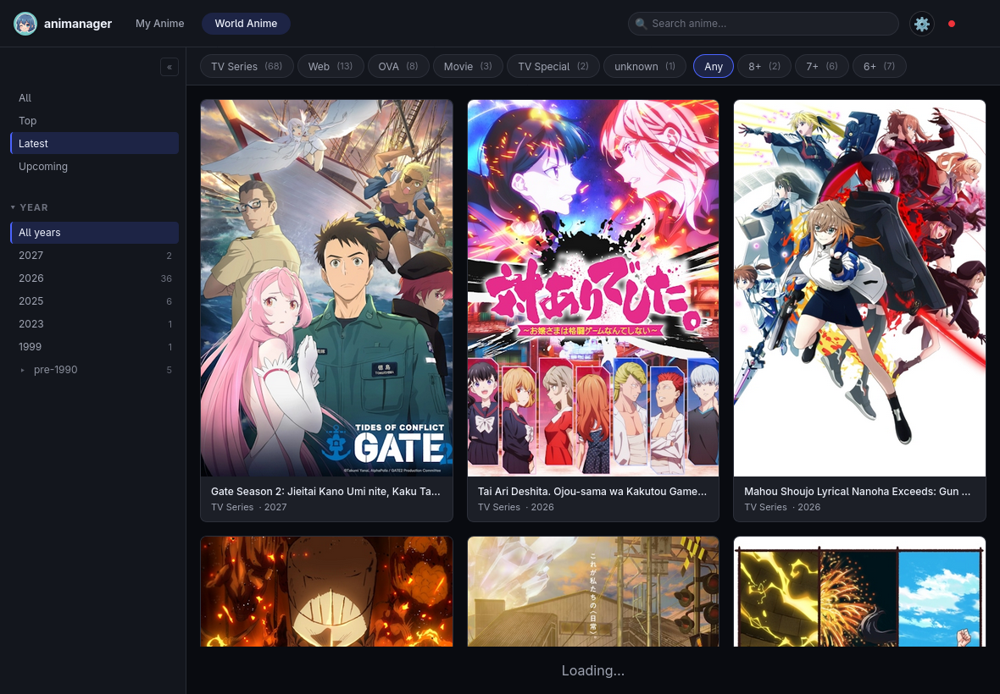
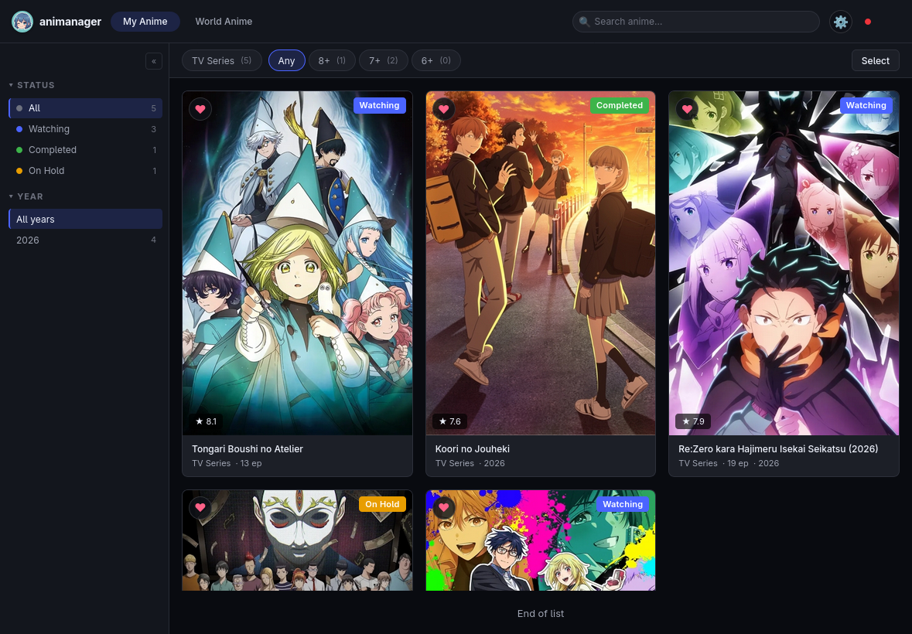
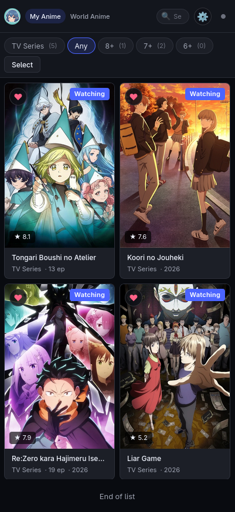
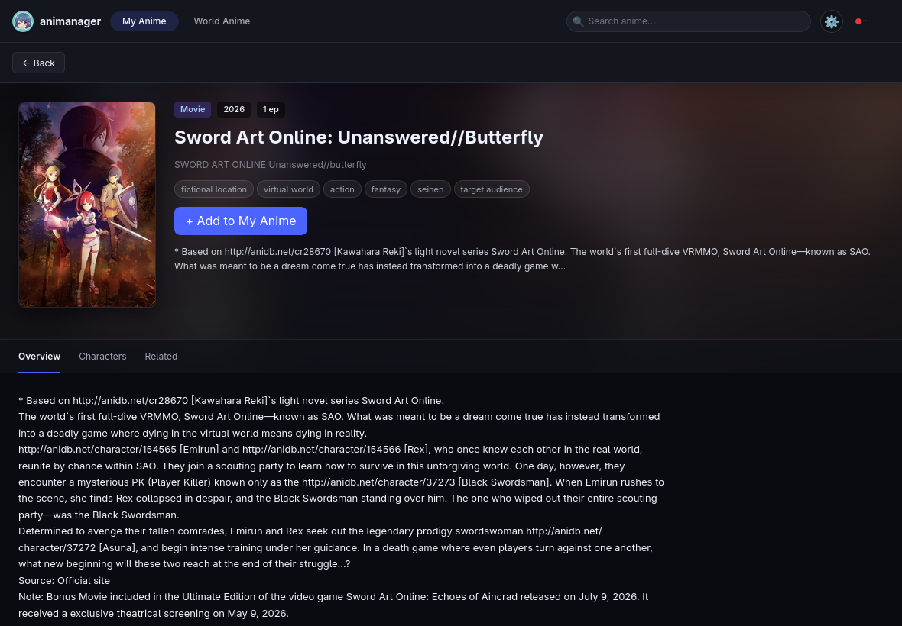

<div align="center">
  
  <h1>animanager</h1>
  <p><em>A self-hosted personal anime manager. AniDB-only, UDP-native, single-user.</em></p>
</div>

<div align="center">
  
</div>

## What it is

A small, focused web app for tracking your anime watchlist. Two top-level views:

- **My Anime**: your watchlist (`plan`, `watching`, `completed`, `on hold`, `dropped`).
- **World Anime**: browse the catalog with sorts (All, Top, Latest, Upcoming) and filters (year, type, rating, genre).

Built for a single user on a home server. No cloud, no telemetry, no third-party integrations beyond AniDB.

## Gallery

<table>
  <tr>
    <td align="center" width="60%">
      <br/>
      <sub>My Anime, tablet</sub>
    </td>
    <td align="center" width="40%">
      <br/>
      <sub>My Anime, iPhone</sub>
    </td>
  </tr>
  <tr>
    <td align="center" width="50%">
      <br/>
      <sub>World Anime, tablet</sub>
    </td>
    <td align="center" width="50%">
      <br/>
      <sub>Detail view, tablet</sub>
    </td>
  </tr>
</table>

## Requirements

- Node.js 22 (LTS) or newer.
- A registered AniDB client (UDP). Free, takes a minute: https://anidb.net/software/add
- About 200 MB of disk for the SQLite database and the cached cover images at full catalog growth.

## Setup

1. Clone and install dependencies:

   ```
   git clone https://github.com/Gsirawan/anime-manager-beta.git
   cd anime-manager-beta
   npm install
   ```

2. Copy the example environment file and fill in your values:

   ```
   cp .env.example .env
   ```

   Required keys (see the next section for what each one does):

   ```
   ANIDB_USER=your-anidb-username
   ANIDB_PASS=your-anidb-password
   ANIDB_CLIENT=animemanager
   ANIDB_CLIENTVER=1
   ANIDB_HTTP_CLIENT=animemanager
   ANIDB_HTTP_CLIENTVER=1
   ANIDB_SERVER=api.anidb.net
   ANIDB_PORT=9000
   ANIDB_LOCAL_PORT=9001
   PORT=3001
   HOST=0.0.0.0
   DATABASE_PATH=./data/anime.db
   LOG_LEVEL=info
   ```

3. Run in development:

   ```
   npm run dev
   ```

   Or build and run in production:

   ```
   npm run build
   node build/index.js
   ```

4. Open http://localhost:3001 in a browser.

The first time you open the app, the **World Anime** tab is empty. The app fetches anime in three ways:

- A daily titles dump at 03:00 UTC populates the local search index.
- A daily UPDATED feed at 04:00 UTC pulls anime that changed in the last three days.
- Navigating to any anime detail page enqueues an on-demand fetch for that aid.

All AniDB UDP calls are queued and spaced at 4 seconds per packet, well under the AniDB long-term rate limit.

## Environment keys

| Key                    | Required | Notes                                                                                                                                                                                                     |
| ---------------------- | -------- | --------------------------------------------------------------------------------------------------------------------------------------------------------------------------------------------------------- |
| `ANIDB_USER`           | yes      | Your AniDB account username.                                                                                                                                                                              |
| `ANIDB_PASS`           | yes      | Your AniDB password. Keep it alphanumeric, the UDP protocol mangles symbols.                                                                                                                              |
| `ANIDB_CLIENT`         | yes      | The UDP client name you registered at https://anidb.net/software/add                                                                                                                                      |
| `ANIDB_CLIENTVER`      | yes      | The version number you set when registering the UDP client.                                                                                                                                               |
| `ANIDB_HTTP_CLIENT`    | yes      | The HTTP client name. Register a separate "HTTP API" client at the same URL above. The base name can match `ANIDB_CLIENT` but it must be its own registration.                                            |
| `ANIDB_HTTP_CLIENTVER` | yes      | Version number of the HTTP client registration.                                                                                                                                                           |
| `ANIDB_SERVER`         | yes      | Default `api.anidb.net`. Per AniDB rules, do not hardcode this in code; keep it in env so they can move it if needed.                                                                                     |
| `ANIDB_PORT`           | yes      | Default `9000`.                                                                                                                                                                                           |
| `ANIDB_LOCAL_PORT`     | yes      | Local UDP source port. Must be fixed and reused across restarts. AniDB bans IPs that send UDP from many different source ports within an hour. Pick any free port above 1024 and keep it. Default `9001`. |
| `ANIDB_API_KEY`        | no       | Set if you want AES128-encrypted UDP. Not required, plaintext UDP works fine.                                                                                                                             |
| `PORT`                 | yes      | HTTP port the app listens on. Default `3001`.                                                                                                                                                             |
| `HOST`                 | yes      | Bind address. `0.0.0.0` for LAN access, `127.0.0.1` for local only.                                                                                                                                       |
| `DATABASE_PATH`        | yes      | SQLite file path. Default `./data/anime.db`. The directory is created on first boot if it does not exist.                                                                                                 |
| `LOG_LEVEL`            | no       | `info` by default. Use `debug` for verbose UDP traces.                                                                                                                                                    |

## Highlights

- AniDB only. Metadata via UDP `ANIME` and `ANIMEDESC`. Recent-changes feed via UDP `UPDATED`. Watchlist sync via UDP `MYLISTADD`. No MAL, no Jikan, no third-party fallbacks.
- UDP client with a custom rate-limited queue at 4 seconds per packet, a fixed local source port to avoid port-churn bans, persistent ban backoff across restarts, and a 4-layer pre-flight gate (paused, tombstoned, recently attempted, recently fetched) that decides whether a packet is worth sending.
- Japanese-origin filter applied after the ANIME response: non-Japanese aids are tombstoned and hidden from the world tab. The classifier is permissive: any Japan-origin tag keeps the anime; only a definite non-Japan origin tombstones it.
- Image proxy at `/img/anidb/[picname]` with disk caching. Components never hotlink the AniDB CDN.
- Self-rate-limited periodic syncs. Titles dump at 24 hour cadence (per AniDB ToS). UPDATED at 72 hour cadence.
- SQLite with WAL mode, monotonic SQL migrations, and full-text search via FTS5.
- Responsive UI for desktop, tablet, and phone. Dark theme with OKLCH design tokens.
- 219 unit tests plus 2 integration tests that drive the real UDP client against a local mock AniDB server in `scripts/fake-anidb-server.mjs`.

## Stack

| Layer      | Pick                                          |
| ---------- | --------------------------------------------- |
| Runtime    | Node.js 22 (LTS)                              |
| Language   | TypeScript (strict) end to end                |
| Framework  | SvelteKit 5 (UI plus API routes)              |
| Styling    | Tailwind plus OKLCH design tokens             |
| DB         | SQLite via `better-sqlite3`, WAL mode         |
| UDP client | Node `dgram` plus a custom rate-limited queue |
| Scheduler  | `node-cron`                                   |
| Tests      | Vitest plus Playwright                        |
| Logging    | `pino` (structured JSON)                      |
| Deploy     | Single Node process, one systemd unit         |

## Architecture

One Node process, three subsystems behind a single SQLite store:

```
SvelteKit Node.js process
├─ HTTP server
│   ├─ UI plus /api/*                reads SQLite only
│   └─ /img/anidb/[picname]          disk-cached image proxy
├─ Job worker (single owner of UDP socket)
│   ├─ pre-flight gate               4-layer fail-fast
│   ├─ UDP transport                 fixed local port, 4 second spacing
│   └─ ban state in meta             persisted across restarts
└─ Scheduler (cron)
    ├─ daily 03:00 UTC               titles_dump_refresh (HTTP gz, no rate limit)
    └─ daily 04:00 UTC trigger       updated_sync (self-rate-limits to 72h)
              │
              ▼
        SQLite (anime.db, WAL)
        data/images/   (image cache)
```

The job worker is the only place that talks to AniDB. HTTP request handlers never block on the network. They read from cache, enqueue jobs if data is missing, return `202 Accepted` for not-yet-cached lookups, and the UI polls until the worker fills the row.

## Local development against a mock server

AniDB has no test or sandbox endpoint, and flood bans can extend with every retry while active. For ban-safe iteration the repo ships a protocol-faithful UDP mock at `scripts/fake-anidb-server.mjs`. Run it on `127.0.0.1:9000` and point your `.env` at it:

```
node scripts/fake-anidb-server.mjs
```

```
ANIDB_SERVER=127.0.0.1
```

The integration test suite (`npm run test:integration`) spawns the mock as a child process and drives the real UDP client at it end to end.

## Tests

```
npm run test:unit          # fast unit tests
npm run test:integration   # spawns the UDP mock
npm run verify             # unit + integration + type-check + production build
```

`npm run verify` is the gate to merge into main.

## License

[MIT](LICENSE) (c) 2026 Ghaith Alsirawan
